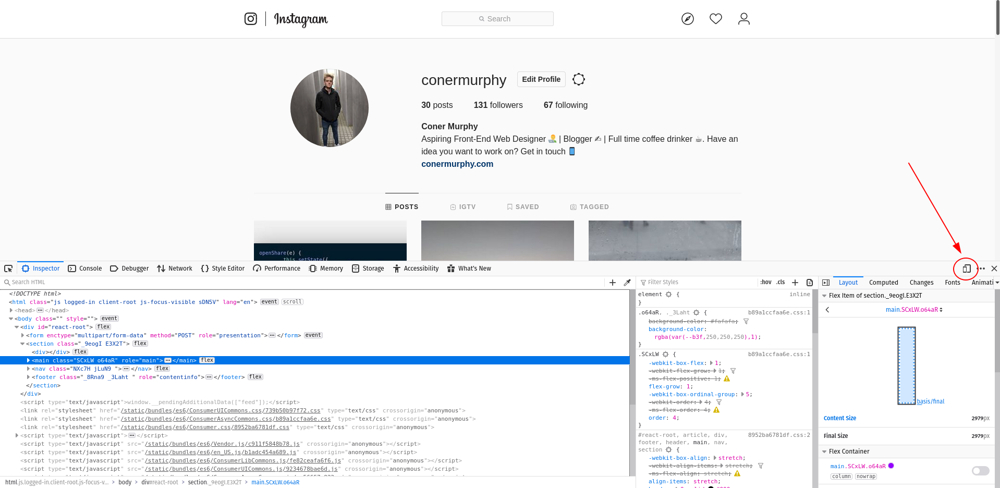
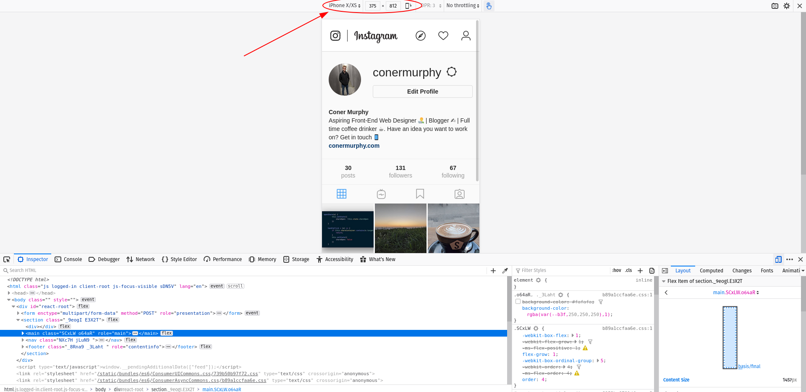

# Posting to Instagram from a Desktop? Here's how.

## Posting to Instagram isn't just for mobile users.

Instagram has worked it's way onto nearly every mobile device in the world, and on the way to doing it they made a platform that is unparralled for sharing visual content. For consumers it's easy to use and everything you could imagine is right at your finger tips. For content-creators it's one of the best places to to try build an audience by sharing your work.

But, for those of us who spend a lot of time on our desktops, be it a laptop or an actual PC there is a serious problem with Instagram.

There's no desktop upload...

Or, is there? Read on to find out how.

### Uploading images from desktops.

Instagram has very much adapted to being a desktop app. Primarily, it is and will always be a mobile application. And, I don't see that changing any time soon. So, instead of waiting for Instagram to implement a feature that may never happen, we need to get creative.

If you log into Instagram on a desktop you should see your Instagram feed but with one notable emission.

No image upload.

#### But, we're only getting started...

Every modern browser has developer tools built in, one of which is a window resizing tool that allows a developer to see how their site looks and feels on different screen sizes. And, this is what we will be using to 'trick' Instagram into thinking we are a mobile user.

With this in mind, here's what we need to do:

- Access the developer tools
- Enable the window resizing tool
- Select a mobile device
- Go crazy uploading all those 🔥 photos.

First, let's access the developer tools. Now, it might be a slightly different method depending on the browser you are using. Personally, I"m using Firefox so to access the developer tools all I need to do is:

- Right click anywhere on the Instagram webpage.
- Select 'Inspect Element'.

This should then trigger your developer tools to open, most of which we can ignore expect one bottom on the right which I've highlighted below.

Once we push this button, your screen should look like:

*(If your screen doesn't look like this, and it still shows the desktop view then you can use the dropdown menu at the top-center of the screen to change between different device sizes, for this to work you need a mobile size so select a size like 'iPhone X)*

Now, you have yourself a virtual mobile phone. We can close the developer panel and browse Instagram like you would on your chosen device.

But, we still have an issue, no button to upload images...

We can soon sort that... 

With a simple refresh, the menu at the bottom of the screen should be displayed.

Now, all we need to do is press the '+' icon in the center of the menu and upload any images you wish without needing to ever leave your desktop. 👍 

Now, that's productivity 🔥.

---

If you've got any questions or are stuck at all just hit me up on one of my social media accounts below and I'll get back to you as soon as possible.  

--

If you enjoyed this article, then please share this article. | It would mean a lot to me for others to be able to read this as well.

Want to discuss this article? Or, just say hi:

[Website 🌐](https://www.conermurphy.com) | [Twitter 🐦](https://twitter.com/ConerMMurphy) | [Instagram 📷](https://www.instagram.com/conermurphy/)